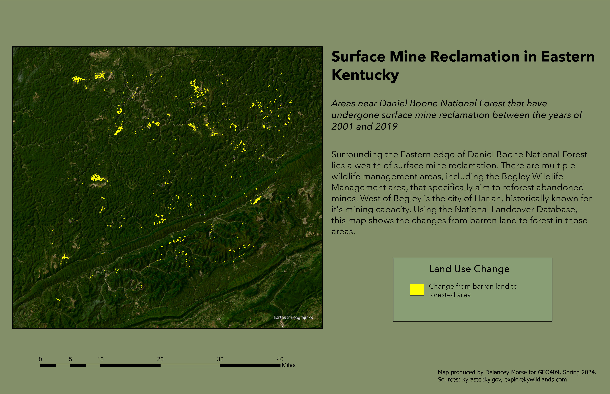

# Change from Barren Land to Forested Area in Eastern Kentucky
## The areas surrounding the Eastern edge of Daniel Boone National Forest that have experienced this change from the years 2001 to 2019. 

These areas have a wealth of mine reclamation. Surrounding the Daniel Boone National Forest, there are a multitude of wildlife managment areas. One of those areas is Begley Wildlife Management, just north of Harlan County, a county that is historically known for it's mining importance in the state of Kentucky. Using the National Landcover Database, this map shows how many areas have changed from barren land to forested area. 

     
*Land use change in Eastern Kentucky*

[Link to high-resolution version](hi-res.pdf)     

Produced by: Delancey Morse for GEO409, University of Kentucky, Spring 2024.
Sources: kyraster.ky.gov, explorekywildlands.com